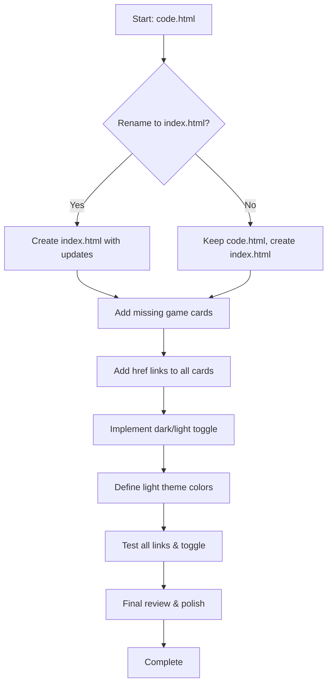

# Game Hub Home Page Implementation Plan

## Overview
Transform `code.html` into a complete game hub home page (`index.html`) with dark/light mode toggle and links to all five game files.

## Current State Analysis
- **Main page**: `code.html` (Hogwarts-themed, Tailwind CSS, three game cards)
- **Game files**: `motion.html`, `whack-a-mole.html`, `shotting-plane.html`, `simple-paddle-ball.html`, `snake.html`
- **Missing cards**: motion.html (Wand Mini), simple-paddle-ball.html (Dobby's Training)
- **Missing links**: Buttons lack `href` attributes
- **Dark mode**: Currently forced dark (`class="dark"` on `<html>`)
- **Teacher requirement**: Add dark/light version toggle

## Implementation Steps

### 1. File Renaming & Structure
- Rename `code.html` → `index.html` (or copy content to new `index.html` and keep `code.html` as backup)
- Ensure all game files remain in same directory

### 2. Add Missing Game Cards
Create two new `<article>` cards following existing design pattern:

**Card for motion.html (Wand Mini)**
- Title: "Wand Mini"
- Description: "Master the wand movements to cast spells with hand tracking."
- Image: Use a magical wand/gesture themed Unsplash image
- Tags: Gesture, Magic, Precision
- Button: "ᚹ CAST SPELL ᚹ"

**Card for simple-paddle-ball.html (Dobby's Training)**
- Title: "Dobby's Training"
- Description: "Help Dobby practice with a magical paddle and ball."
- Image: Use a house-elf or sock themed image
- Tags: Reflex, Training, House‑Elf
- Button: "ᛞ CAST SPELL ᛞ"

### 3. Make Cards Clickable
Wrap each card's button in `<a href="filename.html">` or add `onclick="location.href='filename.html'"`.
Map each card to its corresponding HTML file:
- Snake Challenge → `snake.html`
- Whack‑a‑Mole → `whack-a-mole.html`
- Plane Shooter → `shotting-plane.html`
- Wand Mini → `motion.html`
- Dobby's Training → `simple-paddle-ball.html`

### 4. Dark/Light Mode Toggle
**Implementation Approach**
- Add a toggle button (sun/moon icon) in the header right‑side.
- Use Tailwind's `dark:` variant with `class` strategy.
- Toggle `dark` class on `<html>` element via JavaScript.
- Define light‑theme colors in Tailwind config (extend `colors` for light backgrounds, text, borders).
- Update custom CSS utilities (`bg‑leather`, `bg‑stone`, etc.) to have light variants.

**Light Theme Design**
- Background: light parchment (`#f5f1e8`)
- Text: deep brown (`#2a0202`)
- Gold accents: keep but slightly darker
- Cards: light stone (`#e8e3d7`) with subtle shadows
- Borders: golden but less intense

### 5. Enhancements (Optional but Recommended)
- Add hover effects on cards (scale, shadow intensification)
- Improve bottom navigation (make Rankings and Grimoire functional or remove)
- Add a footer with project credits and link to GitHub (if applicable)
- Ensure all images have appropriate `alt` text
- Add loading lazy attribute for images

### 6. Testing
- Verify all five game links open correctly.
- Test dark/light toggle persistence (maybe use `localStorage`).
- Check responsive behavior on mobile/tablet.

## Workflow Diagram

## Files to Modify
1. `code.html` → `index.html` (or new `index.html`)
2. Tailwind config (inside `<script id="tailwind-config">`) – extend colors for light theme
3. Custom `<style>` block – add light variants of `bg‑leather`, `bg‑stone`, etc.
4. JavaScript for toggle – add inline `<script>` before `</body>`

## Success Criteria
- All five games accessible from the hub.
- Dark/light toggle works and remembers preference.
- Page maintains Hogwarts magical aesthetic in both themes.
- No broken links or styling issues.

## Next Steps
Present this plan to the user for approval, then switch to Code mode for implementation.